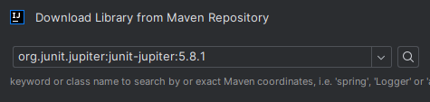
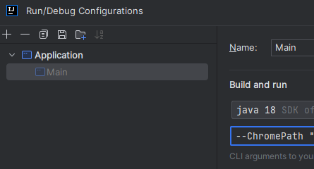
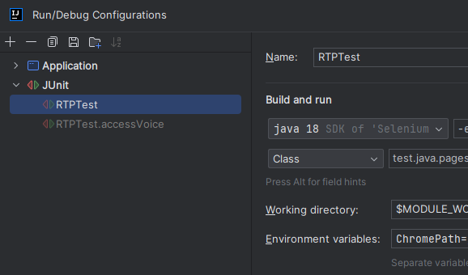

# SeleniumGridVPN
Simple Java program to connect to distinct sites and assess the connectivity of the VPN.

## Installation
Download selenium jar and selenium server jar files from https://www.selenium.dev/downloads/.

- **In IntelliJ, go to File -> Project Structure -> Modules -> + -> Add both the directory from the selenium and the selenium server jar file.**

- **In IntelliJ, go to File -> Project Structure -> Libraries -> + -> Search for org.junit.jupiter:junit-jupiter:5.8.1 .**

Like so:
>

## Usage
### Flags
#### Values
>1. -c/--ChromePath: Path to the Chrome Drivers (chromedriver)
>2. -f/--FirefoxPath: Path to the Firefox Drivers (geckodriver)
>3. -v/--VPN: Status of the VPN connection:
>   - true: The VPN connection is active
>   - false: The VPN connection is disabled
>4. [Optional Flag] Port: Environment variable that can be set to change the port Selenium will be listening on to. Defaults to 4444.
>5. [Optional Flag] ConcurrentBrowsers: Environment variable that can be set to change how many concurrent browsers spawn.
#### Main
Add flags to the execution configuration by going to Run -> Edit Configurations -> Application -> And changing the CLI arguments field

Example: *-ChromePath "Path to Chrome driver executable" -FirefoxPath "Path to Firefox driver executable" -VPN false*
>

#### JUnit Tests
Add VM flag to enable parallel tests execution by going to Run -> Edit Configurations -> JUnit -> And changing the VM arguments field, like so:

Example: -ea -Djunit.jupiter.execution.parallel.enabled=true -Djunit.jupiter.execution.parallel.config.strategy=fixed -Djunit.jupiter.execution.parallel.config.fixed.parallelism=12
>

Add environment variables to the execution configuration by going to Run -> Edit Configurations -> JUnit -> And changing the environment variables field, like so:

Example: ChromePath=Path to Chrome driver executable;FirefoxPath=Path to Firefox driver executable;VPN=false
>
## Selenium Grid
>*Assuming the terminal is on the same dir as the jar file, otherwise use the appropriate path to the jar*

>*Suffices for local testing on a single machine*
> 
>Creating standalone session for selenium:
>
>**java -jar selenium-server-4.14.1.jar standalone**

>*If we want to create a distributed system with several machines*
> 
>Opening hub for selenium:
>
>**java -jar selenium-server-4.14.1.jar hub**
>
>Attaching node to the hub:
>
>**java -jar selenium-server-4.14.1.jar node --port 5555**